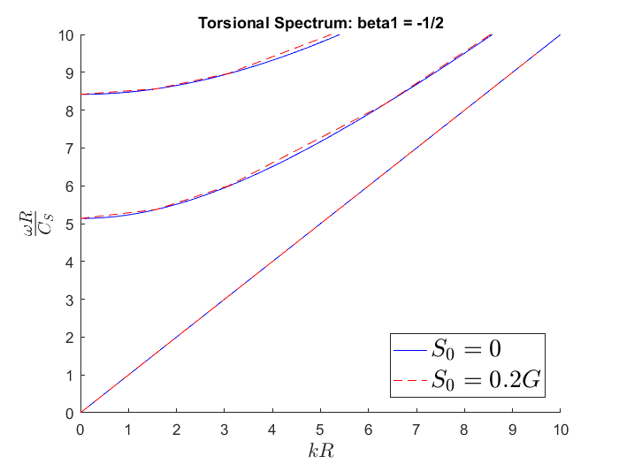
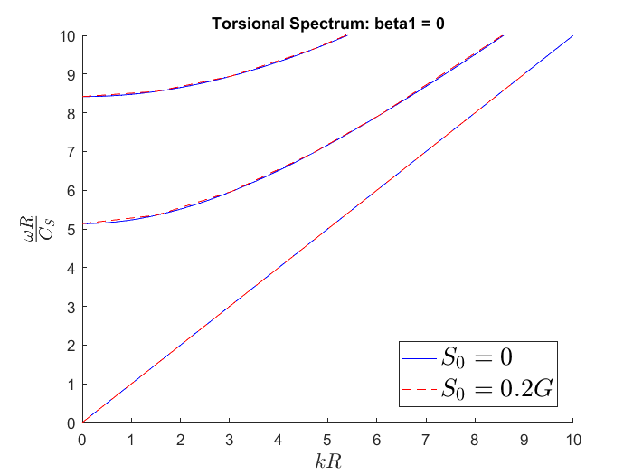
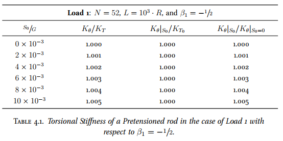
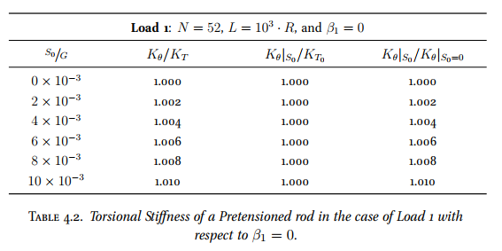

# Master Thesis

This work is my master thesis which is Semi-Analytical Finite Element 
Analysis of Waveguides in Initially-Stressed Elastic Rods. In the 
thesis, we inspect the effects of prestress on the torsional frequency
spectrum of a straight rod of circular cross-section. Regarding computing
technique, we shall convert the equation of incremental wave motion to
the equivalent Principle of Virtual Work with respect to the radial
coordinate r, then apply the semi-discrete finite element method to
approximate the wave modes, which yields the algebraic eigenvalue 
problem relating to the wavenumber k and the mode shape X.

## Authors

- [Le Dinh Tan](https://github.com/ledinhtan)

## Numerical Results

Running the Matlab code to see the numerical results.

- For the infinite rod:

- For the finite rod:

## Programming Language

**Programming language:** Matlab

**Version:** 2016a
## Appendix

From the expression was obtained from the script file (Matlab), we 
also use "Mathematica 11.3" to integrate each element in the A, G, 
and M matrices. 

